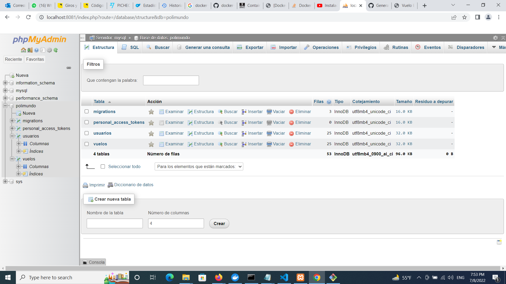
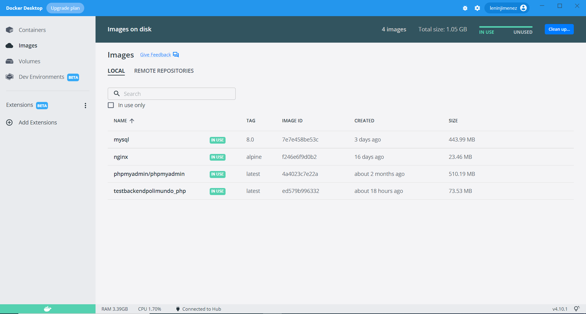
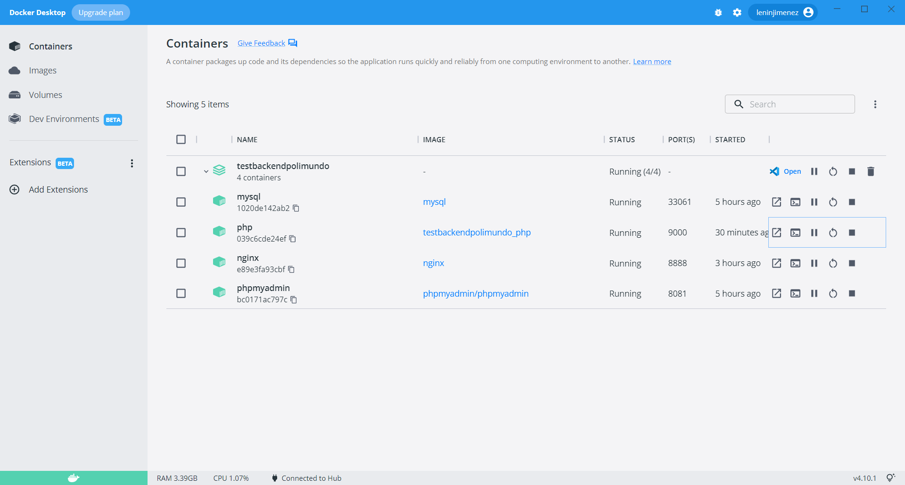
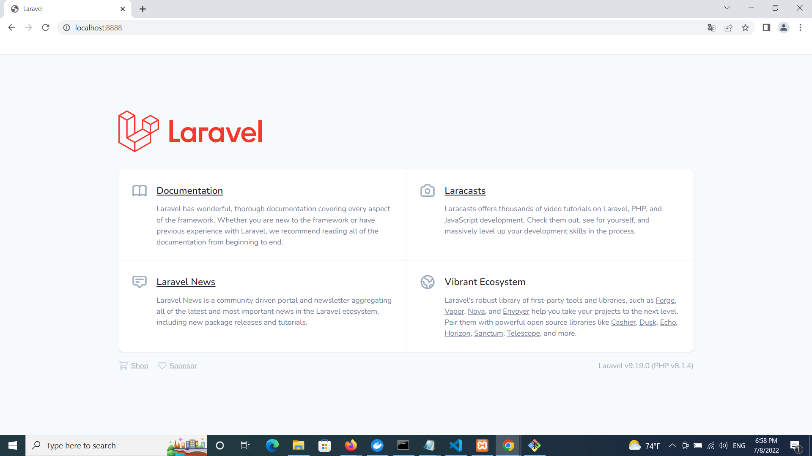
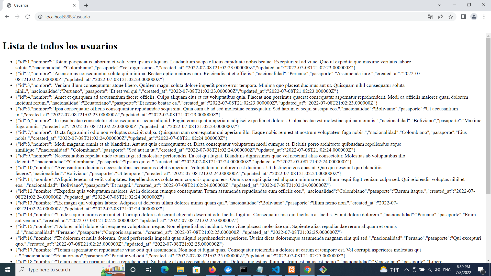
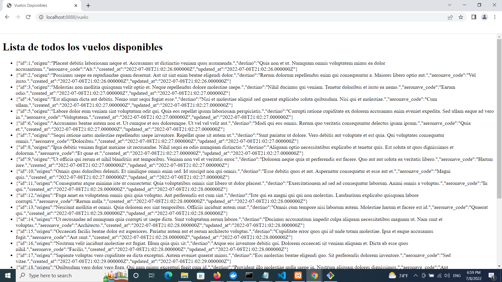
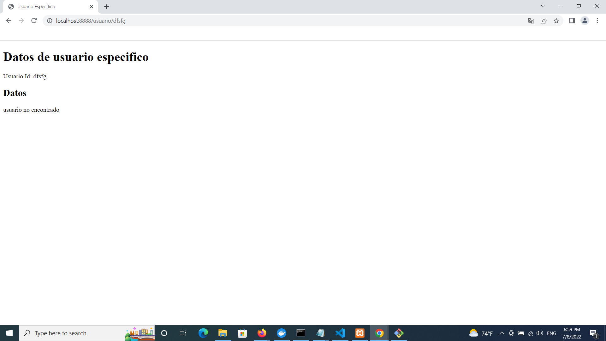
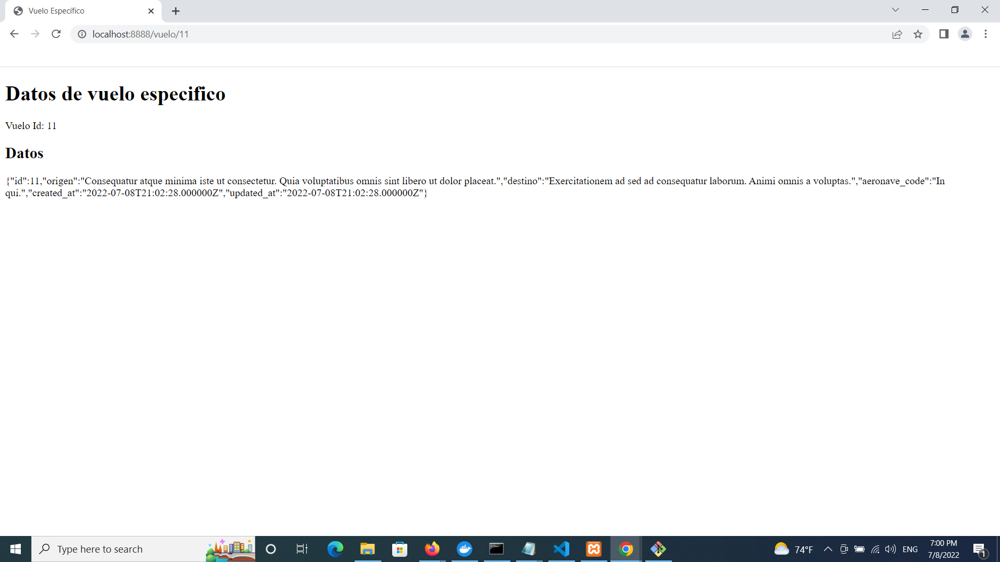

# POLIMUNDO BACKEND CHALLENGE


This is a backend challenge by Polimundo company, the rulers are:

- Use latest version laravel framework
- Create migrations, seeders and models to 2 tables each one with 3 columns (without counting on id and timestamps)
- Create 2 endpoints to each table, the first endpoint will show all table data and the second a specific record by id with the format: /api/table/id
- Extra points if the whole enviroment is deployed using docker

## DESCRIPTION
The project is developed in a docker-compose enviroment with the following images:
- Nginx : alpine
- Mysql : 8.0
- Php : 8.1.4-fpm-alpine
- PhpMyAdmin : phpmyadmin

### Database
The database is named 'polimundo' and incorporates two data tables:
- usuarios
- vuelos
Also, it includes two default supplementary tables.


### Domain
```markdown
    Domain: 'localhosst:8888'
```

### API
The api has two endpoints in the subdomains:
```markdown
    DB_table: usuarios      Endpoint: '/usuario'
    DB_table: vuelos        Endpoint: '/vuelo'
```

#### Note:
To use the project you need to have docker installed and running in your device.

## INSTRUCTIONS
To deploy the project, first you need to clone the current repository, extract it and into the folder run the cli/cmd command: 
```markdown
    docker-compose up -d
```
Verify the images created, you can use cli command or the desktop app. You will have 4 images named:
- mysql
- nginx
- phpmyadmin/phpmyadmin
- testbackendpolimundo_php


And a container named 'testbackendpolimundo' with 4 subcontainers named:
- mysql
- nginx  
- php
- phpmyadmin


Then verify the local laravel enviroment through of a browser using the port '8888' and the localhost, you will have the following answer:


After you create the app enviroment, you have to make the migrations, seeders to deploy or build the data in the database tables, to do this use the following command:
```markdown
    docker-compose exec php php /var/www/html/artisan migrate:fresh --seed
```

## DEPLOYMENT
The home site
```markdown
    url: localhosst:8888
```

To list the whole user list
```markdown
    url: localhosst:8888/usuario
```



To list the whole flights list
```markdown
    url: localhosst:8888/vuelo
```



To list a specific user with the id
```markdown
    url: localhosst:8888/usuario/$id
    example: localhosst:8888/usuario/10
```


if the user is not found, the endpoint answer is:



To list a specific flight with the id
```markdown
    url: localhosst:8888/vuelo/$id
    example: localhosst:8888/vuelo/10
```


if the flight is not found, the endpoint answer is:


## ABOUT THE DEVELOPMENT
The api use:
- 2 Models: Usuario, Vuelo
- 3 controllers: HomeController, UsuarioController, VueloController
- 2 factories to autogenerate db data 
- 1 default template based on 'blade'
- 2 views based on 'blade' by each endpoint and matched to the template
